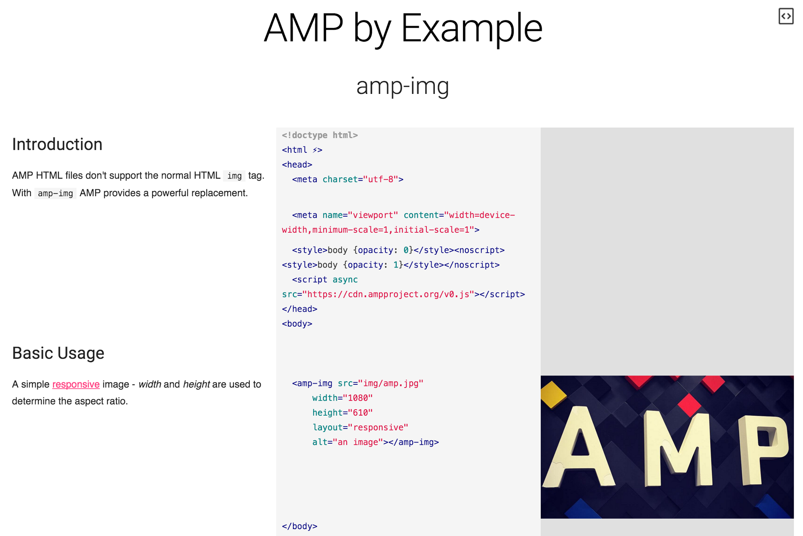

[](https://travis-ci.org/ampproject/amp-by-example)

#AMP by Example

[ampbyexample.com](http://ampbyexample.com/) gives you a hands-on introduction to Accelerated Mobile Pages based on code and live samples. Learn how to create websites with AMP and how to effectively make use of the different AMP components.



In case we are missing any examples, feel free to [let us know](https://github.com/ampproject/amp-by-example/issues/new). Have you got any good examples you would like to contribute? Read on, it’s very easy to add new examples.

## Installation

1. Fork the repository.
2. Install [NodeJS](https://nodejs.org). You will need version 4.0.0 or above.
3. Install [Gulp](http://gulpjs.com/) via `npm`. You may need to use `sudo` depending on your Node installation.

  ```none
  $ npm install -g gulp
  ```

4. Set up the repository:

  ```none
  $ git clone https://github.com/YOUR_GITHUB_NAME/amp-by-example.git
  $ cd amp-by-example
  $ npm install
  ```

5. Build and run the site:

  ```none
  $ gulp
  ```

6. If everything went well, `gulp` should now be running the site on <http://localhost:8000/>

## Creating a new sample

Create a new example with `gulp create`. Set the title via `--name` or `-n` and add it to an existing section using `--dest` or `-d`:

```none
$ gulp create --name amp-img --dest src/20_Components
$ vim src/20_Components/amp-img.html
```

For more descriptive example names including whitespaces use quotes:

```none
$ gulp create --name 'Hello World' --dest src/10_Introduction
$ vim src/10_Introduction/Hello_World.html
```

If you want to create a new sample category, use `--category` or `-c`. Prefix the name with two digits followed by a space to define the sort order:

```none
$ gulp create --name amp-awesome --category "50 More Awesomeness"
$ vim src/50_More_Awesomeness/amp-awesome.html
```

Run validate to validate all examples against AMP spec:

```none
$ gulp validate
```

Run build to generate all examples:

```none
$ gulp build
```

While working on an example you can start a local webserver with auto-reload on <http://localhost:8000/> by running `gulp`:

```none
$ gulp
```

Some components, like [this one](src/30_Advanced/amp-user-notification_with_server_endpoint.html) require an additional server endpoint.

## Writing the sample

Use HTML comments (`<!-- ... -->`) to document your sample code:

```html
<!-- Look! Images in AMP. -->
<amp-img src="img/image1.jpg" width=200 height=100 layout=responsive></amp-img>
```

This works for elements in the header as well:

```html
<head>
  <!-- Import the amp-youtube component -->
  <script async custom-element="amp-youtube" src="https://cdn.ampproject.org/v0/amp-youtube-0.1.js"></script>
  ...
</head>
```

Every HTML comment creates a separate example section spanning the following HTML element.

```html
<!-- This comment spans the whole following div including the two images -->
<div>
  <amp-img src="img/image1.jpg" width=200 height=100 layout=responsive></amp-img>
  <amp-img src="img/image2.jpg" width=200 height=100 layout=responsive></amp-img>
</div>
```

Nested comments are not supported:

```html
<!-- A comment -->
<div>
  <!-- This does not work -->
  <amp-img src="img/image1.jpg" width=200 height=100 layout=responsive></amp-img>
</div>
```

#### Formatting

You can use [markdown](https://help.github.com/articles/github-flavored-markdown/) to format your documentation:

```html
<!--
  A simple [responsive](https://www.ampproject.org/docs/guides/responsive/control_layout.html)
  image - *width* and *height* are used to determine the aspect ratio.
-->
<amp-img src="img/image1.jpg" width=200 height=100 layout=responsive></amp-img>
```

#### Drafts

You can mark samples as drafts if they are still work-in-progress. This means the samples won't show up in the start page.

```json
<!---{
  "draft": true
}--->
```

#### Experimental Components

If your sample is using an experimental component, you can add a metadata section (`<!--- ... --->`) with the JSON variables `experiment` and `component`. This will skip its validation and add an experimental note with instructions to your sample:

```json
<!---{
  "experiment": true,
  "component": "amp-experimenal-component"
}--->
```

#### Preview Mode

Visually rich examples can provide a preview mode like [this](https://ampbyexample.com/samples_templates/news_article/preview/). Enable via metadata in the sample:

```json
<!---{
  "preview": "default"
}--->
```

It is possible to make the preview mode the default version via:

```json
<!---{
  "preview": "default",
  "default": "preview"
}--->
```

There is a special preview mode for AMP for Ads (A4A) samples:

```json
<!---{
  "preview": "a4a"
}--->
```

#### Single Column Layout

If your sample looks better with a single column layout, you can disable the code and preview columns adding the following flags to your sample file:

```json
<!---{
  "hideCode": true,
  "hidePreview": true
}--->
```

## Running the backend server

If you need to run or write a sample that depends on the backend server, you can run a local version.

1. Install the [Google App Engine SDK](https://cloud.google.com/appengine/downloads#Google_App_Engine_SDK_for_Go).
2. Run the backend server in watch mode so it will recompile on change. This assumes that `goapp` is available in your `PATH`, you may need to update your environment accordingly.

   ```none
   $ gulp backend:watch
   ```

3. If everything went well, the full site should now be running on <http://localhost:8080/>

### Adding backend functionality

Sample specific backend endpoints should be defined in their own file, e.g. for a sample `amp-my-component.html` the backend should be `backends/amp-my-component.go`.

#### How to style examples

You can’t reference external stylesheets when creating samples. AMP by Example provides a [default styling](https://github.com/ampproject/amp-by-example/blob/master/templates/css/styles.css) for common elements (p, h1, h2, h3, a, ...) which you should use. Sample specific styles must live in the head of the document using the tag `<style amp-custom>`. Try to keep the additional CSS for samples to a minimum and use the default styles as often as possible. If you compile a sample via Gulp and run it, the default styling will be applied.

Please note: if you copy code from a sample's code section, you will not get the style that you can see in the preview section. 

## Contributing

Please see [the CONTRIBUTING file](CONTRIBUTING.md) for information on contributing to amp-by-example.

## License

AMP by Example is made by the [AMP Project](https://www.ampproject.org/), and is licensed under the [Apache License, Version 2.0](LICENSE).
